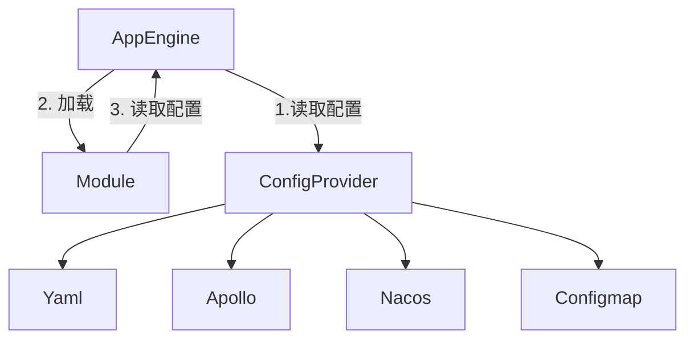
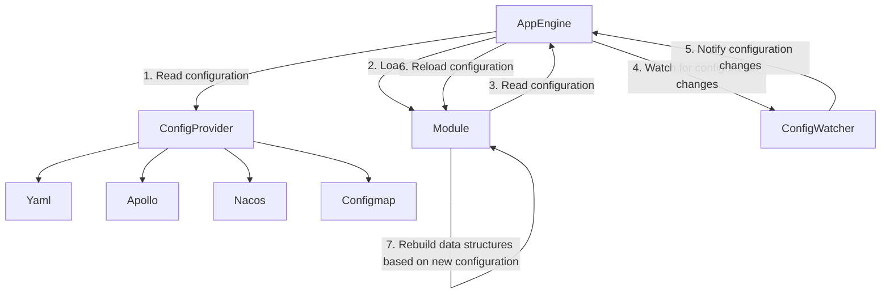

# 配置系统设计

## 配置流程

框架可以启动Module，一个Module是一个.so动态库或者一个golang代码库，AppEngine负责加载配置，初始化Module并启动Module，配置来源可以是本地Yaml文件或者远程apollo、nacos、k8s configmap等，AppEngine统一封装，获取到配置后传递给Module

1. appengine启动获取module.manifest
2. 根据module.manifest获取到module name
3. 根据module name获取对应module的配置文件，配置优先级从高到低如下：
   1. 命令行参数、
   2. 环境变量、
   3. 本地文件
   4. 远程配置（Apollo、naocs、configmap） 
4. 加载Module，传递配置信息
5. 执行Module的初始化

## 配置的动态更新

配置可以在初始化Module的时候立即获取，同时支持在运行过程中，动态监听配置变更，通知Module配置发生了变更，module可以根据新配置重构内存数据和结构

其中

步骤4表示AppEngine会启动一个ConfigWatcher来监控配置变化；

步骤5表示ConfigWatcher将通知AppEngine有新的配置变化；

步骤6表示AppEngine会重新加载新的配置并传递给Module；

步骤7表示Module会根据新的配置重建数据结构。
